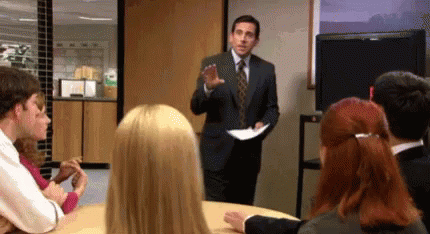

# DVD Screensaver Simulator in Kotlin with LibGDX

This project simulates the classic bouncing DVD logo screensaver using the
LibGDX game development framework for Kotlin.

## Features

- Bouncing DVD logo.
- Customizable logo appearance (size, color).
- Adjustable screen boundaries and bounce behavior.

## Dependencies

LibGDX: https://libgdx.com

## Usage

1. Clone or download this repository.
2. Import the project into your preferred IDE (e.g., IntelliJ IDEA).
3. Ensure you have LibGDX and its dependencies set up correctly.
4. Run the DvdScreensaver class to launch the simulation.

## Customization

- Modify the logo.png file to change the appearance of the bouncing logo.
- Adjustable values to customize:
  - Logo size and color
  - Background color
  - Screen boundaries

## Project Structure

```
├── assets
│         └── logo.png
├── build.gradle
├── core
│         ├── build.gradle
│         └── src
│             └── io
│                 └── antoniomayk
│                     └── dvd
│                         └── screensaver
│                             ├── DvdScreensaver.kt
│                             ├── enums
│                             │         └── CommonColor.kt
│                             ├── misc
│                             │         └── DvdBouncing.kt
│                             ├── textures
│                             │         └── DvdTexture.kt
│                             └── utils
│                                 └── PixmapUtils.kt
├── desktop
│         ├── build.gradle
│         └── src
│             └── io
│                 └── antoniomayk
│                     └── dvd
│                         └── screensaver
│                             └── DesktopLauncher.kt
├── gradle
│         └── wrapper
│             ├── gradle-wrapper.jar
│             └── gradle-wrapper.properties
├── gradle.properties
├── gradlew
├── gradlew.bat
├── README.md
└── settings.gradle
```

## About LibGDX

LibGDX is a popular cross-platform Java framework for creating 2D and 3D games.
It provides a complete development environment with tools for graphics, audio,
input, physics, and more. This project demonstrates a basic usage of LibGDX for
simulating simple animations.

## The real reason why I created that project

Have you ever found yourself staring at the DVD logo bouncing around the screen
at work or even during meetings? If yes, you'll be glad to know that
"The Office" has inspired a Kotlin project replicating this hypnotic experience.
This fun little project will keep you engaged, but use it responsibly and not
get caught watching it during work hours.


